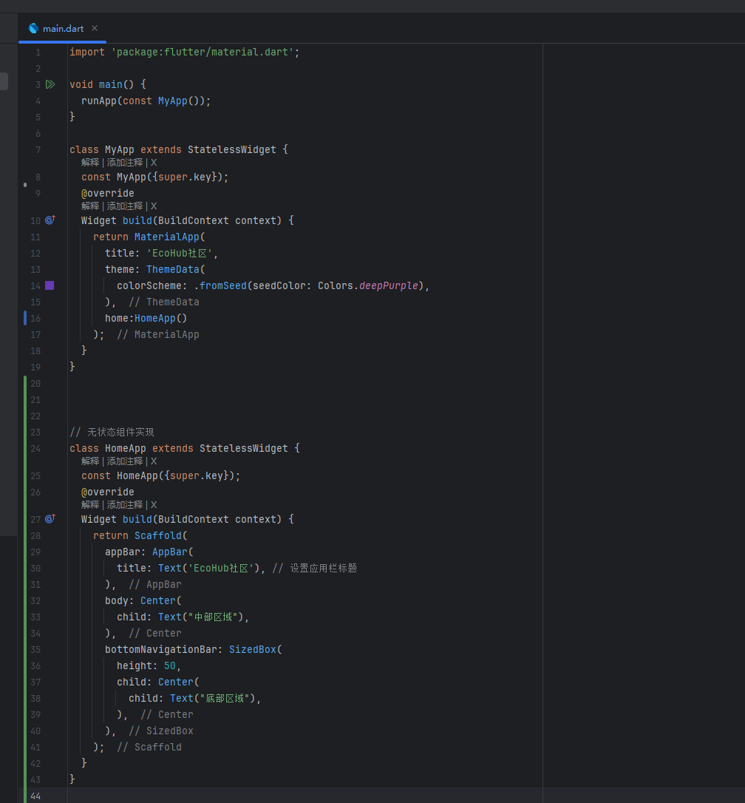

## Flutter学习
#### 为了防止自己之后对Flutter的一些难以记忆的地方忘记则开始记录一下学习的东西

### 2026/2/1 22:18
####  Flutter的相关组件学习

##### 有状态组件(主要用于动态内容展示，外观由内部状态决定)
- 使用方法： 首先自定义一个类，然后继承`StatefulWidget`实现里面的`createState`方法，
  返回一个`State`对象，然后实现`State`对象里面的`build`方法，最后返回一个`widget`也就是返回一个组件
- 下面是具体的写法

##### 无状态组件(主要用于静态内容展示，外观由外部传递的参数决定)
- 使用方法： 首先自定义一个类，然后继承`StatelessWidget`实现里面的`build`方法最后返回`widget`也就是返回一个组件(有点类似函数式编程的意思)
- 下面是具体的写法
  

##### MaterialApp组件（这个按照我的理解其实就是根组件）

### 2026/2/1 22:06

- 首先就是Dart语法的基础学习，这个没什么好说的，基本上和JAVA很像，如果忘记可以看看黑马的Flutter视频
- 然后就是环境的相关配置，说实在的这个配置起来似乎也不是很难，web端只需要浏览器就行，桌面端的环境的话则需要下载Visual Studio然后选择下载C++支持的桌面端依赖就好，
  主要是安卓部分的环境有点操蛋，不过其实也挺简单，下载一个Android Studio然后按照提示安装就好，可以通过`flutter doctor -v`这个命令查看环境依赖是否配置成功，
  配置成功后在IDEA中是能够直接启动对应环境的项目(至于具体操作的话，目前电脑已经配置完成了，就懒得写了，如果需要的话再现查吧QAQ)

